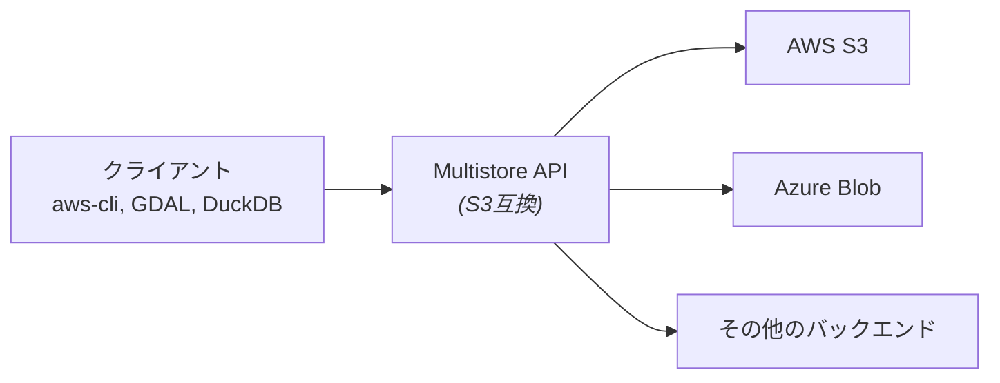

<!--
日本語版。英語版は slides.md。構造・数値・コンポーネントは英語版と一致させること。翻訳は本文のみ。
-->

# Multistore

## S3互換のデータ配信API

<div mt-4 text-sm op-70 max-w-lg>

⚠️ このスライドは英語版をAIで翻訳したものです。誤訳や不自然な表現が含まれる可能性があります。正確な内容は英語版をご確認ください。

<div text-xs mt-1>
AI-generated translation of the English original — it may contain errors.
</div>

</div>

<DecorativeRectangle
  width="50%"
  height="40%"
  zIndex=20
  :position="{
    bottom: '2%',
    right: '2%',
  }"
  :customStyle="{ mixBlendMode: 'multiply' }"
>
  <div w-full h-full relative flex items-end justify-between gap-6 p-4 text-white text-right font-mono>
    <LangQRCode :width="100" class="mb-1" />
    <div flex flex-col items-end>
      <p text-4xl>
        FOSS4G 2026
      </p>
      <p mt-0>
        広島, 日本
      </p>
      <p mt-0>
        2026-09-02
      </p>
      <p text-sm>
        <code text-primary>@alukach</code>
      </p>
    </div>
  </div>
</DecorativeRectangle>
<LogoHorPos position="top-left" height="24px" />

---
layout: iframe-right
url: https://developmentseed.org
scale: 0.5
class: 
---

# こんにちは

## Anthony Lukach

* カナダ・ブリティッシュコロンビア州**ネルソン**在住 🇨🇦
* **Development Seed** のクラウドエンジニア ☁️🔧
* オープンサイエンスを支える**クラウド基盤と認証**が専門

---
# layout: image-left
image: /images/theme/satellite-image-body-of-water.jpg
class: image-narrow
---

# Multistore

<div mt-4 />

> **高性能でS3互換のAPI**を、さまざまなランタイム上に構築するためのツールキット。

<div mt-4 />



<div mt-4 />

<LogoHorNegMono position="bottom-left" />

---
layout: image-left
# Sentinel-2A image of the Southern Tibetan Plateau
image: /images/theme/sentinel2a-southern-tibetan-plateau.jpg
class: image-narrow
---

# なぜ作ったのか

## オブジェクトストレージの価値

<div mt-4 />

超スケーラブルで永続的、高い耐久性を持つファイルストレージ — そして**実績十分**。

<div mt-6 />

- 1オブジェクトあたり最大 **48.8 TB**[^objectsize]
- バケット内のオブジェクト数は **無制限**[^buckets]
- **書き込み 3,500 / 読み取り 5,500 リクエスト毎秒**（*プレフィックス単位*）[^perf]
- **低コスト** — 自前でストレージサーバーを運用するより安価なことがほとんど

<div mt-6 />

> レンジリクエストが使えるからこそ、COG・Zarr・GeoParquet が成立します。

[^objectsize]: [S3 endpoints and quotas](https://docs.aws.amazon.com/general/latest/gr/s3.html#limits_s3)
[^buckets]: [Bucket restrictions and limitations](https://docs.aws.amazon.com/AmazonS3/latest/userguide/BucketRestrictions.html)
[^perf]: [Best practices design patterns: optimizing S3 performance](https://docs.aws.amazon.com/AmazonS3/latest/userguide/optimizing-performance.html)

<LogoHorNegMono position="bottom-left" />

---

# 互換性

## S3対応ツールはどこにでもある

```bash
# aws-cli, boto3
export AWS_ENDPOINT_URL_S3=https://data.source.coop
aws s3 cp s3://tge-labs/aef/v1/annual/manifest.txt . \
  --no-sign-request
```

```bash
# GDAL — 同じエンドポイント、パス形式、署名なし
AWS_S3_ENDPOINT=data.source.coop \
AWS_VIRTUAL_HOSTING=FALSE \
AWS_NO_SIGN_REQUEST=YES \
gdalinfo /vsis3/tge-labs/aef/v1/annual/2025/10S/x00nkabexxts2wnud-0000000000-0000000000.tiff
```

```sql
# DuckDB
LOAD httpfs;
CREATE SECRET (
  TYPE s3, 
  ENDPOINT 'data.source.coop', 
  URL_STYLE 'path'
);
SELECT count(*) FROM 's3://tge-labs/aef/v1/annual/aef_index.parquet';
```

<LogoHorPos position="bottom-right" height="24px" />

---
layout: cover
background: '/images/theme/landsat8-ayon-island.jpg'
class: px-5
---

# 大胆な主張 🌶️

<div class="bg-black/85 rounded-lg py-10 px-10 text-white mt-6 text-3xl font-300 leading-snug">

データ配信APIが必要なら、それはおそらく
<span text-primary font-bold>オブジェクトストレージ上</span>にあるべきで、そしておそらく<span text-primary font-bold>S3 APIを実装</span>すべきです。

</div>

---
layout: image-right
# Landsat 9 Image of Western Guinea-Bissau
image: /images/theme/landsat9-western-guinea-bissau.jpg
class: image-narrow
---

# なぜAPIゲートウェイか
## オブジェクトストレージだけでは足りない

<div mt-4 />

難しい、あるいはそもそも提供されていないことがあるからです:

<div mt-4 />

- すべてのデータセットに**恒久的なアドレス**を（データが移動しても）
  - 外部バケットにあるデータも**そのままの場所で配信**できる
- 「公開か、IAMポリシーか」を超えた**アクセス制御**
- 一定サイズを超えたプレフィックスや、ダウンロードしすぎたユーザーへの**アクセス制限**
- `--requester-pays` を超えた**課金の制御**
- **HTTP/2 や HTTP/3** — ブラウザ上のクラウドネイティブ地理空間処理が求めるもの
- **クラウドをまたいだ統一的なユーザー体験**
  - ひとつの**認証・認可**が複数のクラウドで機能する

<div mt-6 />

<LogoHorNegMono position="bottom-right" />

---
layout: iframe-right
url: https://source.coop
scale: 0.5
class: iframe-wide
---

# Source Cooperative

## 実際のニーズ

> Sourceを利用すれば、データ提供者は自前でサーバーを運用したり、データポータル、API、ダッシュボードを構築したりすることなく、Web上でデータを公開できます。**つまり、Source上のリポジトリにファイルをアップロードし、他の人と共有可能なURLを取得することが可能になるのです。**

<div mt-4 text-sm>

`source.coop` · 詳しくは
[radiant.earth/blog — what is Source Cooperative](https://radiant.earth/blog/2023/10/what-is-source-cooperative/)

</div>

---
layout: cover
background: '/images/theme/Tanezrouft_Basin.jpg'
class: px-5
---

## Source Cooperative の規模

<div grid grid-cols-2 gap-4 mt-3 text-white>

  <div class="bg-black/70 rounded-lg py-5 px-6">
    <div text-xs font-mono uppercase tracking-widest opacity-60>保存容量</div>
    <div flex items-baseline gap-2 mt-2>
      <span text-7xl font-300 leading-none>8.3</span>
      <span text-2xl font-300>PB</span>
    </div>
    <div text-xs opacity-70 font-mono mt-1>AWS S3 · us-west-2 · AWS Open Data Program による</div>
    <div flex items-baseline gap-2 mt-4>
      <span text-4xl font-300 leading-none>120</span>
      <span text-lg font-300>TB</span>
    </div>
    <div text-xs opacity-70 font-mono mt-1>Azure Blob Storage · AI for Earth program による</div>
  </div>

  <div class="bg-black/70 rounded-lg py-5 px-6">
    <div text-xs font-mono uppercase tracking-widest opacity-60>配信 · 28日間</div>
    <div flex items-baseline gap-2 mt-2>
      <span text-7xl font-300 leading-none>912</span>
      <span text-2xl font-300>TB</span>
    </div>
    <div text-xs opacity-70 font-mono mt-1>データプロキシ経由のエグレス</div>
    <div flex items-baseline gap-2 mt-4>
      <span text-4xl font-300 leading-none>218</span>
      <span text-lg font-300>百万リクエスト</span>
    </div>
    <div text-xs opacity-70 font-mono mt-1>平均 毎秒115リクエスト</div>
  </div>

</div>

<div class="bg-black/70 rounded-lg py-4 px-6 text-white mt-4">
  <div flex items-center gap-5>
    <div text-xs font-mono uppercase tracking-widest opacity-60 shrink-0>バースト</div>
    <div flex-1 flex items-center gap-3>
      <span text-lg font-300 font-mono opacity-70 shrink-0>20</span>
      <div flex-1 h-2px rounded-full style="background: linear-gradient(to right, rgba(255,255,255,0.2), var(--slidev-theme-primary))" />
      <span text-4xl font-300 leading-none text-primary shrink-0>2,000</span>
      <span text-xs font-mono opacity-70 shrink-0>RPS</span>
    </div>
  </div>
</div>

<LogoHorNegMono position="bottom-right" />

---
layout: image-left
# Landsat 9 image of Kangerdlugssuaq Glacier, Greenland
image: /images/theme/landsat9-kangerdlugssuaq-greenland.jpg
class: image-narrow
---

# 出発点

## すでにデータプロキシはあった

Source は、どのクラウドにデータが置かれていても、すべてのデータセットに恒久的なアドレスを与える**S3互換API**を運用しています。ルーティング、認可、バックエンドの認証情報を担っていました。

<div mt-6 />

- ECS 上で動く Rust アプリケーション
- バックエンドごとに**個別の実装**が必要
- すべてのトラフィックが **AWS ロードバランサー**を通って外に出ていた

<LogoHorNegMono position="bottom-left" />

---
layout: image-right
image: /images/content/alb-costs.png
backgroundSize: contain
---

# 課題

## コストの増大

<div text-lg>

**2026年3月**: プラットフォームの利用が伸びるにつれ、**1日あたり 38 TB 超**のエグレスがロードバランサーを通過するようになりました。

AWS のエグレス料金は **$0.09 / GB**。

</div>

<div text-3xl font-300>

→ <span v-mark.highlight.orange>**1日 $3.5K**</span>

</div>

<LogoHorNegMono position="bottom-right" />

---
layout: image-right
# Landsat 8 image of Klyuchevskaya, Kamchatka
image: /images/theme/landsat8-klyuchevskaya-kamchatka.jpg
class: image-narrow
---

# AWS Open Data Program

## 細かい条件

<div text-lg>

AWS Open Data Program が負担するのは **S3 からのエグレス**です。

**ロードバランサー**からのエグレスは対象外です。

私たち自身のプロキシが、エグレスの出口になってしまっていました。

**結論**: <span v-mark.underline>データプロキシの新しい置き場所が必要だった</span>。

</div>

<LogoHorNegMono position="bottom-right" />

---
layout: image-right
# Landsat 8 image of the Ord River in Australia
image: /images/theme/landsat8-ord-river-australia.jpg
class: image-narrow
---

# 要件

## 新しいランタイムに求めたもの

<div mt-8 text-lg >

- **エグレス料金がかからない** &nbsp; <span text-primary font-bold>← 必須</span>
- **高いスケーラビリティ** — 急激なバーストを処理できること
- **高い可用性** — 頻繁なコールドスタートは許容できない
- **実行時間の上限がない** — ダウンロードには時間がかかることがある

</div>

<div mt-6 />

できれば:

- **グローバルに分散** — 読み手の近くで動く
- **AWS の*内側*でも動かせる** — リージョン内転送のために

<LogoHorNegMono position="bottom-right" />

---
layout: image-right
image: https://blog.cloudflare.com/_image?href=https%3A%2F%2Fblog.cloudflare.com%2F_emdash%2Fapi%2Fmedia%2Ffile%2F01KW45Y7DRY8HFDEADFRR8PVXE.png&w=1430&h=522&f=webp&fit=cover&position=center
backgroundSize: contain
scale: 0.5
---

# 解決策

## Cloudflare Workers

<div mt-3 />

コンテナでも Lambda でもありません。コードは **V8 isolate** — Chrome と同じエンジン — の中で動き、数千の isolate がひとつのプロセスを共有します。

<div mt-4 />

| 要件                     | Workers                                            |
| ------------------------ | -------------------------------------------------- |
| **エグレス料金なし**     | ✅ &nbsp;<span text-primary font-bold>必須</span>   |
| 高いスケーラビリティ     | ✅ &nbsp;サーバーレスで安価                         |
| コールドスタートなし     | ✅ &nbsp;マイクロ秒で起動                           |
| 実行時間の上限なし       | ✅ &nbsp;ただしCPU時間は課金対象                    |
| グローバルに分散         | ✅ &nbsp;335都市以上                                |

<div mt-3 text-sm>

ただし: 動かせるのは **WASM か JavaScript** だけです。

</div>

---
layout: image-left
image: /images/theme/landsat9-apostle-islands-lake-superior.jpg
class: image-narrow
---

# 目標

## ビジネス要件とプロキシ基盤を分離する

<div mt-6 />

|                        |                                       |
| ---------------------- | ------------------------------------- |
| **アプリケーション基盤** | `developmentseed/multistore`          |
| **ビジネスロジック**     | `source-cooperative/data.source.coop` |

<div mt-6 />

- 毎回の個別実装なしに**複数のバックエンド**に対応する
- **複数のランタイム環境**に対応する（まずは Workers から）

<div mt-6 />

> 「S3の前に置く小さなプロキシ」を書いたことがある人が、もう書かなくて済むように。

<LogoHorNegMono position="bottom-left" />

---
layout: title
image: /images/theme/landsat9-bangladesh-coast.jpg
---

# 仕組み

## ランタイムの制約が設計を決めた

<LogoHorPos position="top-left" height="24px" />

---
layout: image-left
# Landsat 9 Image of Western Guinea-Bissau
image: /images/theme/landsat9-western-guinea-bissau.jpg
class: image-narrow
---

# 言語

## なぜ Rust か

<div mt-6 />

Workers で動くのは **JavaScript か WASM** だけです。

<v-click>

<div mt-6 />

JavaScript が本来の選択肢で、私たちにも経験があります。ただし長時間動き続けるプロキシとしての性能には不安がありました。

</v-click>

<v-click>

<div mt-8 />

> **Rust** がちょうどよい選択でした — 社内に知見があり、求める性能が出て、
> WASM ツールチェーンも成熟しており、同じコアが**ネイティブサーバー**や
> **AWS Lambda** 向けにもコンパイルできます。

</v-click>

<LogoHorNegMono position="bottom-left" />

---
layout: two-cols
gap: 8
leftRatio: 48
---

## 課題

Cloudflare Workers に実行時間の上限はありません。希少な資源は **CPU時間**です。

WASM と JavaScript は**メモリが分かれています**。

JS の `ReadableStream` を Rust のバイトストリームに変換すると、その境界で
**すべてのバイトがコピー**されます — ファイルサイズに比例してCPUを消費します。

<div mt-5 />

> 1 TB のダウンロードは、私たちにはないCPUを食い尽くします。

::right::

## 解決策

<div mt-5 />

### ゼロコピー・パススルー

オブジェクトの作成・読み取りでは、ゲートウェイが**署名付きURL**を発行します。ランタイムはリクエストを転送するだけ。レスポンスボディは JS の `ReadableStream`
のままプラットフォームへ返ります。

Rust が読むのは**ヘッダーとメタデータ**だけです。

<LogoHorPos position="bottom-right" height="24px" />

---
layout: iframe-right
url: https://docs.rs/multistore
scale: 0.6
---

## コア

# `multistore`

<div mt-4 />

ゲートウェイ本体: **S3リクエストの解析**、**SigV4の検証**、`ProxyGateway`
ステートマシン、そして他のすべてが差し込まれるレジストリのトレイト。

<div mt-4 />

S3の話し方は知っていますが、*あなたの*ルールは何も知りません — それはトレイトの実装として渡されます。

<div mt-4 />

**バックエンド**は `object_store` クレート経由です — S3・Azure Blob・GCS をひとつのAPIで扱えるので、振る舞いを一度書けばどこでも動きます。

<LogoHorNegMono position="bottom-left" />

---
layout: iframe-right
url: https://docs.rs/multistore-oidc-provider
scale: 0.6
---

## 送信方向の認証

# `multistore-oidc-provider`

<div mt-4 />

プロキシが**バックエンド**に、パスワードを保存せずに到達する方法。

<div mt-4 />

- Multistore 自身が OIDC プロバイダになる: JWT に署名し、JWKS を配信します
- クラウド側がそれを信頼し、短期の認証情報を返します

<div mt-4 />

> デプロイのどこにも、長期間有効な鍵はありません。

<LogoHorNegMono position="bottom-left" />

---
layout: iframe-right
url: https://docs.rs/multistore-sts
scale: 0.6
---

## 受信方向の認証

# `multistore-sts`

<div mt-4 />

**ユーザー**が自分を証明する方法。

<div mt-4 />

- `AssumeRoleWithWebIdentity` による OIDC トークン交換
- RS256 の JWT、JWKS のキャッシュ、信頼ポリシーの評価
- **一時的な認証情報**を発行

<div mt-4 />

> クライアントから見えるのは変わらずアクセスキーとシークレットです。違いは、それが失効することです。

<LogoHorNegMono position="bottom-left" />

---
layout: image-right
# Landsat 9 image of Kangerdlugssuaq Glacier, Greenland
image: /images/theme/landsat9-kangerdlugssuaq-greenland.jpg
class: image-narrow
---

# その他のクレート

## 必要なものだけ選ぶ

<div mt-6 />

### `multistore-metering`

利用量の記録とクォータの適用。⚠️ **実験的**、本番ではまだ使っていません。

<div mt-4 />

### `multistore-path-mapping`

キーとバックエンドの対応づけの制御。Source Cooperative には必要ですが、みなさんには任意です。

<div mt-4 />

### `multistore-cf-workers`

Multistore を Cloudflare Workers で動かすための定型コード。

<div mt-6 />

> リポジトリにあるランタイム例: **ネイティブサーバー**、**Lambda**、**CF Workers**。

<LogoHorNegMono position="bottom-left" />

---
layout: two-cols
gap: 8
class: px-5
---

# どう書いたか

## AIをたくさん使いました 😬

<div mt-4 />

このプロジェクトは、AIエージェント主導という新しい書き方の実験でもありました。
**速さと品質を両立しながら、高性能で安全なシステムを作れるか?**

<div mt-6 />

> **インターフェースに集中する。** 中身はエージェントに書かせる。

::right::

<div mt-4 />

### 型システム

* Rust の**型システム**が最低限の信頼を担保する

### 徹底したテスト

- コードと並んだ**269のユニットテスト**
- ローカルサーバーに対する**40の統合テスト**
- デプロイ済みサーバーに対する**17のスモークテスト**

### 徹底した静的解析

- **セキュリティ**は `cargo-audit`
- **正しさ**は `cargo clippy`

### 徹底したレビュー

- **自動レビュー**は Claude + Ponytail
- **人によるレビュー** 🙋‍♂️

---
layout: cover
background: '/images/theme/Tanezrouft_Basin.jpg'
class: px-5
---

# インパクト

## 現在のコスト

<div class="bg-black/80 rounded-lg py-6 px-8 text-white mt-5 font-mono">

  <div flex justify-between items-baseline text-sm opacity-70>
    <span>典型的な1か月</span>
    <span>2.18億リクエスト · 912 TB のエグレス</span>
  </div>

  <div h-1px bg-white opacity-20 my-5 />

  <div flex justify-between items-baseline>
    <span text-lg>Cloudflare Workers での配信</span>
    <span>
      <span text-5xl font-300 text-primary>$73</span>
      <span text-sm opacity-70 ml-2>/月 · 1日 $2.60</span>
    </span>
  </div>

  <div text-xs opacity-50 mt-2>
    （Durable Objects・Analytics Engine・可観測性のコストを除く）
  </div>

  <div h-1px bg-white opacity-20 my-5 />

  <div flex justify-between items-baseline>
    <span text-xl>ALBのエグレスとして回避できた額</span>
    <span>
      <span text-6xl font-300 text-primary>$82K</span>
      <span text-sm opacity-70 ml-3>/月 · 1,100分の1</span>
    </span>
  </div>

  <div text-xs opacity-60 mt-6>
    そしてエグレス自体は今も <b>$0</b> — <b>AWS Open Data Sponsorship Program</b>
    が S3 からのエグレスを負担しており、Multistore はそれを S3 に留めています。
  </div>

</div>

---
layout: image-right
# Fjords on the southeastern coast of Greenland
image: /images/theme/blue-white-red-abstract-painting.jpg
class: image-narrow
---

## インパクト

# コストの内訳

<div mt-6 />

Source Cooperative のストレージ費用は、おおよそ:

<div class="flex h-14 rounded overflow-hidden font-mono text-xs text-white mt-3">
  <div class="w-2/3 bg-gray-500 flex items-center px-4">ストレージ &nbsp;·&nbsp; 66%</div>
  <div class="w-1/3 bg-primary flex items-center px-4">エグレス &nbsp;·&nbsp; 32%</div>
</div>

<div mt-6 />

今はその両方を **AWS Open Data Sponsorship Program** が負担しています。前のスライドが成り立つのは、そのおかげです。

<div mt-4 />

このプログラムの**対象外**のバケットなら、**エグレス料金のかからない**
オブジェクトストレージ（例: Cloudflare R2）を選べば、その3分の1は丸ごと消えます。

<LogoHorNegMono position="bottom-left" />

---
layout: image-right
# Landsat 9 image of Taklimakan Desert, China
image: /images/theme/landsat9-taklimakan-desert-china.jpg
---

# まとめ

## 最後に

- データアクセスAPIが必要なら、**オブジェクトストレージを使う**
- カスタマイズしたデータアクセスAPIが必要なら、**Multistore を使う**
- **ぜひご連絡ください!** 使えそうだと思われたら教えてください。お手伝いします。

---
layout: title
# Landsat 9 image of Apostle Islands, Lake Superior
# https://unsplash.com/photos/j7HqdQqn7Jo
image: /images/theme/landsat9-apostle-islands-lake-superior.jpg
---

# ご清聴ありがとうございました

## Thank you!

<DecorativeRectangle
  width="30%"
  height="96%"
  zIndex=11
  :position="{
    bottom: '2%',
    right: '2%',
  }"
  :customStyle="{ mixBlendMode: 'multiply' }"
>
  <div w-full h-full relative flex flex-col items-start justify-between p-4 text-white text-left class="[&_a]:no-underline [&_a]:text-white [&_a:hover]:text-gray-200">
    <div mb-4 flex flex-col gap-5 items-start justify-start text-sm font-mono class="[&_a]:flex [&_a]:items-center [&_a]:gap-1">
      <Logo src="/images/logos/hor--neg-mono@2x.png" height="24px" alt="DevelopmentSeed" class="!relative !top-0 !left-0" />
      <a href="https://source.coop" target="_blank" title="Source Cooperative">
        <WebsiteIcon size="20" pr-1 />
        <span>source.coop</span>
      </a>
      <a href="https://developmentseed.org" target="_blank" title="Website">
        <WebsiteIcon size="20" pr-1 />
        <span>developmentseed.org</span>
      </a>
      <a href="https://github.com/developmentseed/multistore" target="_blank" title="GitHub">
        <GitHubIcon size="20" pr-1 />
        <span>@developmentseed/multistore</span>
      </a>
      <a href="https://github.com/alukach" target="_blank" title="GitHub">
        <GitHubIcon size="20" pr-1 />
        <span>@alukach</span>
      </a>
      <CurrentUrlQRCode
        fullWidth
        image='/images/logos/symbol--neg-mono@2x.png'
        :dotsOptions="{ type: 'classy-rounded', color: 'white' }"
      />
    </div>
    <div opacity-70 w-100 class="text-[10px]">
      <div>出典:</div>
      <div>
        スライドの画像は <a href="https://unsplash.com/@usgs?utm_source=ds-slides&utm_medium=referral" target="_blank" class="text-white hover:text-gray-200">USGS</a> / <a href="https://unsplash.com/?utm_source=ds-slides&utm_medium=referral">Unsplash</a>
      </div>
    </div>
  </div>
</DecorativeRectangle>
