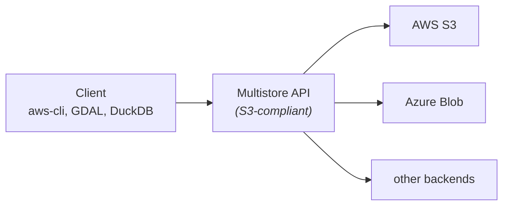

<!-- Original Outline (DO NOT DELETE) 

Outline V2

- Introduction
  - Anthony Lukach
  - Cloud Engineer @ Development Seed
- Introduction to Multistore
  - An toolkit for build performant S3 Compliant APIs for various runtimes
- Why we built Multistore
  - Value of Object Storage
    - Hyper scalable, persistent, durable file storage
      - Battle tested
      - Files can be as large as **49TB each** [^server-quota](https://docs.aws.amazon.com/general/latest/gr/s3.html#limits_s3)
      - **Unlimited number** of objects within a bucket [^bucket-limits](https://docs.aws.amazon.com/AmazonS3/latest/userguide/BucketRestrictions.html)
      - Supports **3,500 PUT/COPY/POST/DELETE or 5,500 GET/HEAD requests per second** per partitioned Amazon S3 prefix [^best-practices](https://docs.aws.amazon.com/AmazonS3/latest/userguide/optimizing-performance.html)
    - Integration with all of S3's  of compatability with existing tools
  - So why would you want to build an API around a serverless offering?
    - Some things are hard...
    - Access controls
    - Limiting access to...
      - a bucket or a prefix after it reaches a certain size
      - a user if they have download too much data
    - Billing based on consumption (beyond `--requester-pays`)
    - No support HTTP2 or HTTP3 which is useful for in-browser CNG analysis/visualization
    - Bespoke for each cloud provider
  - Beyond theoreticals, we had a real need: Source Cooperative
    - Quick introduction to Source Cooperative
    - High volumes of storage and distribution made possible by the generous support from AWS
    - Made use of a data proxy to provide durable API
    - Had proxy, but had some problems
      - each backend needed to be custom integrated
      - egress through ALB
  - Costs were growing out of control
    - AWS bills $0.09/GB of egress
    - Our "success" was resulting in ALB seeing 38+ TB of egress / day -> $3.5K/day
    - Search for new runtime
    - landed on Cloudflare Workers
      - iframe: https://www.cloudflare.com/products/workers/
      - Describe paradigm
        - V8 Isolates
      - Describe costs
        - No (addionally) egress fees **critical**
        - Serverless — available and scalable, without being expensive
        - No cold start (effectively)
        - No wall-clock timeout — a download can take a long time
        - Globally distributed — close to whoever is reading
  - Goal:
    - rebuild data proxy as configurable components
    - separate application components (github.com/developmentseed/multistore) from business logic (github.com/source-cooperative/data.source.coop)
    - support multiple backends and multiple runtime environments
- How it works
  - Guided by Cloudflare constraints
  - Rust (and possibly to WASM) for multi-runtime support
  - Zero Copy
  - Shape of project
    - Core Components
      - `multistore` - core: traits, S3 parsing, SigV4, registries
      - `multistore-oidc-provider` - **outbound** auth: JWT signing, federation
        - can be configured as a **trusted identity provider**, allowing it to authenticate with a backend withtout passwords
    - Use Cases
      - `multistore-sts` - **inbound** auth: OIDC token exchange
        - can allow users to generate temporary credentials
      - `multistore-metering` - usage metering and quota enforcement
        - experimental tooling to keep track of a users usage and possibly restrict access if certain conditions are met
    - Niche Helpers
      - `multistore-static-config` - buckets, roles, credentials from TOML or JSON
        
      - `multistore-path-mapping` - `/{account}/{product}/{key}` → backend
        - 
      - `multistore-cf-workers` - Cloudflare Workers (WASM) runtime
        - makes it simpler to work with Cloudflare Workers tooling
    - Example runtimes on https://github.com/developmentseed/multistore
  - Uses Object Store for multi-cloud support
- How we built it
  - notes on AI
- Impacts to Source Cooperative
  - Savings on egress
    - 912 TB @ $0.09/GB -> $84K in monthly savings
  - Ability to dynamically add backends
    - https://ui.source.coop/iframe.html?id=features-data-connections-dataconnectionform--edit-with-stored-key&viewMode=story
  - Advanced analytics
    - 
  - Advanced auth flows
    - Authentication via Github
- Operational costs for Source Cooperative
  - Current expense distribution for Source Cooperative
  - Operational cost for proxy
  - What egress fees would be if we continue to use AWS ALB
    - Savings of 
- Where to go from here?
  - stand alone application?
  - more use-cases

Acknowledge: https://xkcd.com/927/
-->

# Multistore

## An S3-compliant data distribution API

<DecorativeRectangle
  width="50%"
  height="40%"
  zIndex=20
  :position="{
    bottom: '2%',
    right: '2%',
  }"
  :customStyle="{ mixBlendMode: 'multiply' }"
>
  <div w-full h-full relative flex items-end justify-between gap-6 p-4 text-white text-right font-mono>
    <LangQRCode :width="100" class="mb-1" />
    <div flex flex-col items-end>
      <p text-4xl>
        FOSS4G 2026
      </p>
      <p mt-0>
        Hiroshima, Japan
      </p>
      <p mt-0>
        2026-09-02
      </p>
      <p text-sm>
        <code text-primary>@alukach</code>
      </p>
    </div>
  </div>
</DecorativeRectangle>
<LogoHorPos position="top-left" height="24px" />

---
layout: iframe-right
url: https://developmentseed.org
scale: 0.5
class: 
---

# Hello

## Anthony Lukach

* Based in **Nelson, British Columbia, Canada** 🇨🇦
* Cloud Engineer at **Development Seed** ☁️🔧
* Focus on **cloud infrastructure and auth** to enable open science

---
# layout: image-left
image: /images/theme/satellite-image-body-of-water.jpg
class: image-narrow
---

# Multistore

<div mt-4 />

> A toolkit for building **performant, S3-compliant APIs** that run on many
> different runtimes.

<div mt-4 />



<div mt-4 />

<LogoHorNegMono position="bottom-left" />

---
layout: image-left
# Sentinel-2A image of the Southern Tibetan Plateau
image: /images/theme/sentinel2a-southern-tibetan-plateau.jpg
class: image-narrow
---

# Why build this?

## The value of object storage

<div mt-4 />

Hyper-scalable, persistent, durable file storage — and **battle tested**.

<div mt-6 />

- Objects up to **48.8 TB each**[^objectsize]
- An **unlimited number** of objects per bucket[^buckets]
- **3,500 write / 5,500 read requests per second**, *per prefix*[^perf]
- **Cost effective**, typically much more affordable than running your own storage servers

<div mt-6 />

> Range requests on top of that are what make COG, Zarr and GeoParquet work.

[^objectsize]: [S3 endpoints and quotas](https://docs.aws.amazon.com/general/latest/gr/s3.html#limits_s3)
[^buckets]: [Bucket restrictions and limitations](https://docs.aws.amazon.com/AmazonS3/latest/userguide/BucketRestrictions.html)
[^perf]: [Best practices design patterns: optimizing S3 performance](https://docs.aws.amazon.com/AmazonS3/latest/userguide/optimizing-performance.html)

<LogoHorNegMono position="bottom-left" />

---

# Compatibilty

## S3 Integrations are everywhere!

```bash
# aws-cli, boto3
export AWS_ENDPOINT_URL_S3=https://data.source.coop
aws s3 cp s3://tge-labs/aef/v1/annual/manifest.txt . \
  --no-sign-request
```

```bash
# GDAL — same endpoint, path-style, unsigned
AWS_S3_ENDPOINT=data.source.coop \
AWS_VIRTUAL_HOSTING=FALSE \
AWS_NO_SIGN_REQUEST=YES \
gdalinfo /vsis3/tge-labs/aef/v1/annual/2025/10S/x00nkabexxts2wnud-0000000000-0000000000.tiff
```

```sql
# DuckDB
LOAD httpfs;
CREATE SECRET (
  TYPE s3, 
  ENDPOINT 'data.source.coop', 
  URL_STYLE 'path'
);
SELECT count(*) FROM 's3://tge-labs/aef/v1/annual/aef_index.parquet';
```

<LogoHorPos position="bottom-right" height="24px" />

---
layout: cover
background: '/images/theme/landsat8-ayon-island.jpg'
class: px-5
---

# Hot take 🌶️

<div class="bg-black/85 rounded-lg py-10 px-10 text-white mt-6 text-3xl font-300 leading-snug">

If you need a data distribution API, it should probably be
<span text-primary font-bold>on object storage</span>, and it should probably
<span text-primary font-bold>implement the S3 API</span>.

</div>

---
layout: image-right
# Landsat 9 Image of Western Guinea-Bissau
image: /images/theme/landsat9-western-guinea-bissau.jpg
class: image-narrow
---

# Why an API Gateway?
## Object Storage might not be enough

<div mt-4 />

Because some things are **hard**, or simply not on offer:

<div mt-4 />

- **One durable address** for every dataset, even if the dataset moves
  - Ability to **serve existing datasets** where they lay, even in external buckets
- **Access control** beyond "public, or an IAM policy"
- **Limiting access** to a prefix once it passes a size, or to a user once they have downloaded too much
- **Advanced billing controls**, beyond `--requester-pays`
- **HTTP/2 or HTTP/3** — which browser-based cloud-native geospatial wants
- **Unified user experience across cloud providers**
  - One set of **authN/authZ** works for multiple clouds

<div mt-6 />

<LogoHorNegMono position="bottom-right" />

---
layout: iframe-right
url: https://source.coop
scale: 0.5
class: iframe-wide
---

# Source Cooperative

## A real need

> Source allows data providers to publish data on the web without needing to run their own server, create a data portal, an API, or a dashboard. In plain English, this means we **allow people to upload files to a repository in Source and then get a URL that they can share with other people.**

<div mt-4 text-sm>

`source.coop` · more at
[radiant.earth/blog — what is Source Cooperative](https://radiant.earth/blog/2023/10/what-is-source-cooperative/)

</div>

---
layout: cover
background: '/images/theme/Tanezrouft_Basin.jpg'
class: px-5
---

## Source Cooperative stats

<div grid grid-cols-2 gap-4 mt-3 text-white>

  <div class="bg-black/70 rounded-lg py-5 px-6">
    <div text-xs font-mono uppercase tracking-widest opacity-60>Stored</div>
    <div flex items-baseline gap-2 mt-2>
      <span text-7xl font-300 leading-none>8.3</span>
      <span text-2xl font-300>PB</span>
    </div>
    <div text-xs opacity-70 font-mono mt-1>AWS S3 · us-west-2 · via AWS Open Data Program</div>
    <div flex items-baseline gap-2 mt-4>
      <span text-4xl font-300 leading-none>120</span>
      <span text-lg font-300>TB</span>
    </div>
    <div text-xs opacity-70 font-mono mt-1>Azure Blob Storage · via AI for Earth program</div>
  </div>

  <div class="bg-black/70 rounded-lg py-5 px-6">
    <div text-xs font-mono uppercase tracking-widest opacity-60>Served · 28 days</div>
    <div flex items-baseline gap-2 mt-2>
      <span text-7xl font-300 leading-none>912</span>
      <span text-2xl font-300>TB</span>
    </div>
    <div text-xs opacity-70 font-mono mt-1>egress through the data proxy</div>
    <div flex items-baseline gap-2 mt-4>
      <span text-4xl font-300 leading-none>218</span>
      <span text-lg font-300>M requests</span>
    </div>
    <div text-xs opacity-70 font-mono mt-1>115 per second, on average</div>
  </div>

</div>

<div class="bg-black/70 rounded-lg py-4 px-6 text-white mt-4">
  <div flex items-center gap-5>
    <div text-xs font-mono uppercase tracking-widest opacity-60 shrink-0>Bursts</div>
    <div flex-1 flex items-center gap-3>
      <span text-lg font-300 font-mono opacity-70 shrink-0>20</span>
      <div flex-1 h-2px rounded-full style="background: linear-gradient(to right, rgba(255,255,255,0.2), var(--slidev-theme-primary))" />
      <span text-4xl font-300 leading-none text-primary shrink-0>2,000</span>
      <span text-xs font-mono opacity-70 shrink-0>RPS</span>
    </div>
  </div>
</div>

<LogoHorNegMono position="bottom-right" />

---
layout: image-left
# Landsat 9 image of Kangerdlugssuaq Glacier, Greenland
image: /images/theme/landsat9-kangerdlugssuaq-greenland.jpg
class: image-narrow
---

# Where we started

## It already had a data proxy

Source operates an **S3-compliant API** that gives every dataset a durable
address, regardless of which cloud it actually sits in. It performed routing, authorization, and backend credentials.

<div mt-6 />

- A Rust application on ECS
- Every backend needed a **custom integration**
- All traffic egressed through an **AWS load balancer**

<LogoHorNegMono position="bottom-left" />

---
layout: image-right
image: /images/content/alb-costs.png
backgroundSize: contain
---

# Problem

## Cost growth

<div text-lg>

**March 2026**: As the platform grew in usage, we started to see egress spikes of **38+ TB / day**, all going through the application load balancer.

AWS bills egress @ **$0.09 / GB**.

</div>

<div text-3xl font-300>

→ <span v-mark.highlight.orange>**$3.5K per day**</span>

</div>

<LogoHorNegMono position="bottom-right" />

---
layout: image-right
# Landsat 8 image of Klyuchevskaya, Kamchatka
image: /images/theme/landsat8-klyuchevskaya-kamchatka.jpg
class: image-narrow
---

# AWS Open Data Program

## Fine details

<div text-lg>

The AWS Open Data Program covers **egress from S3**.

It does not cover egress from a **load balancer**.

Our own proxy had become the point of egress.

**Outcome**: <span v-mark.underline>We needed to find a new home for the data proxy</span>.

</div>

<LogoHorNegMono position="bottom-right" />

---
layout: image-right
# Landsat 8 image of the Ord River in Australia
image: /images/theme/landsat8-ord-river-australia.jpg
class: image-narrow
---

# Needs

## What we need from a new runtime

<div mt-8 text-lg >

- **No egress fees** &nbsp; <span text-primary font-bold>← critical</span>
- **Highly scalable** — able to handle high bursts of traffic
- **Highly available** — frequent cold start times are unacceptable
- **No wall-clock timeout** — a download can take a long time

</div>

<div mt-6 />

Stretch goals:

- **Globally distributed** — close to whoever is reading
- **Could be run *inside* AWS** — for in-region transfers.

<LogoHorNegMono position="bottom-right" />

---
layout: image-right
image: https://blog.cloudflare.com/_image?href=https%3A%2F%2Fblog.cloudflare.com%2F_emdash%2Fapi%2Fmedia%2Ffile%2F01KW45Y7DRY8HFDEADFRR8PVXE.png&w=1430&h=522&f=webp&fit=cover&position=center
backgroundSize: contain
scale: 0.5
---

# Solution

## Cloudflare Workers

<div mt-3 />

Not containers, not Lambda. Code runs in a **V8 isolate** — the same engine as
Chrome — with thousands of isolates sharing one process.

<div mt-4 />

| Requirement           | Workers                                              |
| --------------------- | ---------------------------------------------------- |
| **No egress fees**    | ✅ &nbsp;<span text-primary font-bold>critical</span> |
| Highly scalable       | ✅ &nbsp;Serverless and cheap                         |
| No cold start         | ✅ &nbsp;starts in microseconds                       |
| No wall-clock timeout | ✅ &nbsp;but CPU time is metered                      |
| Globally distributed  | ✅ &nbsp;335+ cities                                  |

<div mt-3 text-sm>

The catch: you ship **WASM or JavaScript**, and nothing else.

</div>

---
layout: image-left
image: /images/theme/landsat9-apostle-islands-lake-superior.jpg
class: image-narrow
---

# Goal

## Separate business requirements from proxy tooling

<div mt-6 />

|                            |                                       |
| -------------------------- | ------------------------------------- |
| **Application components** | `developmentseed/multistore`          |
| **Business logic**         | `source-cooperative/data.source.coop` |

<div mt-6 />

- Support **multiple backends** without a custom integration each time
- Support **multiple runtime environments**, starting with Workers

<div mt-6 />

> Anyone who has written "a small proxy in front of S3" should be able to
> stop writing it.

<LogoHorNegMono position="bottom-left" />

---
layout: title
image: /images/theme/landsat9-bangladesh-coast.jpg
---

# How it works

## Shaped by the constraints of the runtime

<LogoHorPos position="top-left" height="24px" />

---
layout: image-left
# Landsat 9 Image of Western Guinea-Bissau
image: /images/theme/landsat9-western-guinea-bissau.jpg
class: image-narrow
---

# Language

## Why Rust

<div mt-6 />

Workers run **JavaScript or WASM** — and nothing else.

<v-click>

<div mt-6 />

JavaScript is the native choice, and we have that experience. But we had concerns about its performance for a long-running proxy.

</v-click>

<v-click>

<div mt-8 />

> **Rust** was the sweet spot — in-house support, the performance we wanted,
> mature WASM tooling, and the same core compiles for a **native server** and even **AWS Lambda**.

</v-click>

<LogoHorNegMono position="bottom-left" />

---
layout: two-cols
gap: 8
leftRatio: 48
---

## Challenge

On Cloudflare Workers there is no wall-clock timeout. The scarce resource is **CPU time**.

WASM and JavaScript have **separate memory**.

Turning a JS `ReadableStream` into a Rust byte stream copies **every byte**
across that boundary — CPU spent in proportion to file size.

<div mt-5 />

> A 1 TB download would burn CPU we do not have.

::right::

## Solution

<div mt-5 />

### Zero-copy passthrough

When creating or reading objects, the gateway signs a **presigned URL**. The runtime forwards the request. The response body stays a JS `ReadableStream` and goes straight back to the platform.

Rust only ever reads **headers and metadata**.

<LogoHorPos position="bottom-right" height="24px" />

---
layout: iframe-right
url: https://docs.rs/multistore
scale: 0.6
---

## Core

# `multistore`

<div mt-4 />

The gateway itself: **S3 request parsing**, **SigV4 verification**, the
`ProxyGateway` state machine, and the registry traits everything else plugs into.

<div mt-4 />

It knows how to speak S3. It knows nothing about *your* rules — those arrive
as trait implementations.

<div mt-4 />

**Backends** go through the `object_store` crate — one API for S3, Azure Blob
and GCS, so behaviour is written once and works everywhere.

<LogoHorNegMono position="bottom-left" />

---
layout: iframe-right
url: https://docs.rs/multistore-oidc-provider
scale: 0.6
---

## outbound auth

# `multistore-oidc-provider`

<div mt-4 />

How the proxy reaches a **backend**, without a stored password.

<div mt-4 />

- Multistore *is* an OIDC provider: it signs JWTs and serves JWKS
- the cloud backend federates to it and returns short-lived credentials

<div mt-4 />

> No long-lived keys anywhere in the deployment.

<LogoHorNegMono position="bottom-left" />

---
layout: iframe-right
url: https://docs.rs/multistore-sts
scale: 0.6
---

## inbound auth

# `multistore-sts`

<div mt-4 />

How a **user** proves who they are.

<div mt-4 />

- OIDC token exchange, via `AssumeRoleWithWebIdentity`
- RS256 JWTs, JWKS caching, trust-policy evaluation
- mints **temporary credentials**

<div mt-4 />

> The client still sees an access key and a secret. The difference is that it
> expires.

<LogoHorNegMono position="bottom-left" />

---
layout: image-right
# Landsat 9 image of Kangerdlugssuaq Glacier, Greenland
image: /images/theme/landsat9-kangerdlugssuaq-greenland.jpg
class: image-narrow
---

# Other Crates

## Take what you need

<div mt-6 />

### `multistore-metering`

Usage recording and quota enforcement. ⚠️ **Experimental**, not in production today.

<div mt-4 />

### `multistore-path-mapping`

Controls for how a key relates to a backend. Needed for Source Cooperative,
optional for you.

<div mt-4 />

### `multistore-cf-workers`

Boilerplate for running Multistore on CLoudflare Workers.

<div mt-6 />

> Example runtimes in the repo: **native server**, **Lambda**, **CF Workers**.

<LogoHorNegMono position="bottom-left" />

---
layout: two-cols
gap: 8
class: px-5
---

# How we wrote it

## a lot of AI 😬

<div mt-4 />

This project also served as an experiment in a new way to write code, largely
driven by AI agents. **How can we build performant and secure systems with speed
and quality?**

<div mt-6 />

> **Focus on the interfaces.** Let the agents fill in the middle.

::right::

<div mt-4 />

### Typed system

* Rust's **type system** instills a base level of confidence

### Thorough testing

- **269 unit tests** alongside the code
- **40 integration tests** against a local server
- **17 smoke tests** against the deployed server

### Thorough linting

- **security** via `cargo-audit`
- **correctness** via `cargo clippy`

### Thorough reviews

- **automated** via Claude + Ponytail
- **human** 🙋‍♂️

---
layout: cover
background: '/images/theme/Tanezrouft_Basin.jpg'
class: px-5
---

# Impact

## What it costs now

<div class="bg-black/80 rounded-lg py-6 px-8 text-white mt-5 font-mono">

  <div flex justify-between items-baseline text-sm opacity-70>
    <span>A typical month</span>
    <span>218 M requests · 912 TB egress</span>
  </div>

  <div h-1px bg-white opacity-20 my-5 />

  <div flex justify-between items-baseline>
    <span text-lg>Serving it on Cloudflare Workers</span>
    <span>
      <span text-5xl font-300 text-primary>$73</span>
      <span text-sm opacity-70 ml-2>/mo · $2.60 a day</span>
    </span>
  </div>

  <div text-xs opacity-50 mt-2>
    (before Durable Objects, Analytics Engine, and observability costs)
  </div>

  <div h-1px bg-white opacity-20 my-5 />

  <div flex justify-between items-baseline>
    <span text-xl>Avoided, in ALB egress</span>
    <span>
      <span text-6xl font-300 text-primary>$82K</span>
      <span text-sm opacity-70 ml-3>a month · 1,100× cheaper</span>
    </span>
  </div>

  <div text-xs opacity-60 mt-6>
    And the egress itself is still <b>$0</b> — the <b>AWS Open Data Sponsorship
    Program</b> covers egress from S3, and Multistore keeps it there.
  </div>

</div>

---
layout: image-right
# Fjords on the southeastern coast of Greenland
image: /images/theme/blue-white-red-abstract-painting.jpg
class: image-narrow
---

## Impact

# Where the bill goes

<div mt-6 />

Source Cooperative's storage bill, roughly:

<div class="flex h-14 rounded overflow-hidden font-mono text-xs text-white mt-3">
  <div class="w-2/3 bg-gray-500 flex items-center px-4">Storage &nbsp;·&nbsp; 66%</div>
  <div class="w-1/3 bg-primary flex items-center px-4">Egress &nbsp;·&nbsp; 32%</div>
</div>

<div mt-6 />

Today the **AWS Open Data Sponsorship Program** pays both — which is the only
reason any of the previous slide works.

<div mt-4 />

For buckets **outside** that program, an object store with **no egress fees** (e.g. Cloudflare R2) removes that third entirely.

<LogoHorNegMono position="bottom-left" />

---
layout: image-right
# Landsat 9 image of Taklimakan Desert, China
image: /images/theme/landsat9-taklimakan-desert-china.jpg
---

# Wrap-up

## Parting Thoughts

- If you need a data access API, **use object storage**
- If you need a customized data access API, **use Multistore**
- **We'd love to hear from you!** Let us know if this seems like something you'd like to use. We want to help!

---
layout: title
# Landsat 9 image of Apostle Islands, Lake Superior
# https://unsplash.com/photos/j7HqdQqn7Jo
image: /images/theme/landsat9-apostle-islands-lake-superior.jpg
---


# Thank you!

## ご清聴ありがとうございました

<DecorativeRectangle
  width="30%"
  height="96%"
  zIndex=11
  :position="{
    bottom: '2%',
    right: '2%',
  }"
  :customStyle="{ mixBlendMode: 'multiply' }"
>
  <div w-full h-full relative flex flex-col items-start justify-between p-4 text-white text-left class="[&_a]:no-underline [&_a]:text-white [&_a:hover]:text-gray-200">
    <div mb-4 flex flex-col gap-5 items-start justify-start text-sm font-mono class="[&_a]:flex [&_a]:items-center [&_a]:gap-1">
      <Logo src="/images/logos/hor--neg-mono@2x.png" height="24px" alt="DevelopmentSeed" class="!relative !top-0 !left-0" />
      <a href="https://source.coop" target="_blank" title="Source Cooperative">
        <WebsiteIcon size="20" pr-1 />
        <span>source.coop</span>
      </a>
      <a href="https://developmentseed.org" target="_blank" title="Website">
        <WebsiteIcon size="20" pr-1 />
        <span>developmentseed.org</span>
      </a>
      <a href="https://github.com/developmentseed/multistore" target="_blank" title="GitHub">
        <GitHubIcon size="20" pr-1 />
        <span>@developmentseed/multistore</span>
      </a>
      <a href="https://github.com/alukach" target="_blank" title="GitHub">
        <GitHubIcon size="20" pr-1 />
        <span>@alukach</span>
      </a>
      <CurrentUrlQRCode
        fullWidth
        image='/images/logos/symbol--neg-mono@2x.png'
        :dotsOptions="{ type: 'classy-rounded', color: 'white' }"
      />
    </div>
    <div opacity-70 w-100 class="text-[10px]">
      <div>Attributions:</div>
      <div>
        Slide images from <a href="https://unsplash.com/@usgs?utm_source=ds-slides&utm_medium=referral" target="_blank" class="text-white hover:text-gray-200">USGS</a> on <a href="https://unsplash.com/?utm_source=ds-slides&utm_medium=referral">Unsplash</a>
      </div>
    </div>
  </div>
</DecorativeRectangle>
